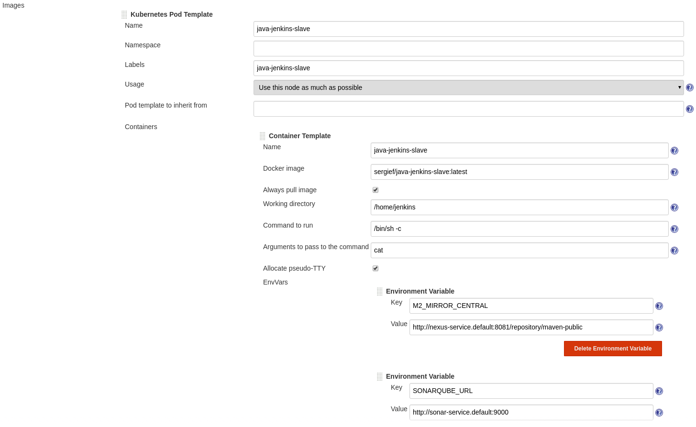

# Kubernetes Development Cluster

This project contains everything needed to create a Kubernetes cluster for development and CI purposes. The following components are installed:
* Jenkins CI
* Nexus
* Sonar

## How to use it

### Configure NFS shared volumes

This Kubernetes cluster stores the persistent data of the services in NFS volumes. You will need to share the following volumes from the host `192.168.99.1`. The shares would need to be accessible from `192.168.99.0/24`.

This is a sample of NFS configuration, stored in `/etc/exports.d/k8s-dev-cluster.exports`:
```
/srv/nfs/k8s-dev-cluster		  192.168.99.0/24(rw,sync,crossmnt,fsid=0)
/srv/nfs/k8s-dev-cluster/jenkins  192.168.99.0/24(rw,sync)
/srv/nfs/k8s-dev-cluster/nexus    192.168.99.0/24(rw,sync)
/srv/nfs/k8s-dev-cluster/sonar    192.168.99.0/24(rw,sync)

```
In this example, the host shares the directories from `/srv/nfs/k8s-dev-cluster/`.

### Start the services

Start the cluster using the following command:
```bash
make start
```
And then install the different services using the following command:
```bash
make install
```

Wait for starting all the services. You can access to the minikube dashboard to monitor the different services using this command:
```bash
make dashboard
```


You can also start a Ngrok proxy that forwards all the traffic to the Jenkins instance (useful for creating webhooks from github).
```bash
make ngrok_proxy
```

## URLs for accessing to the services
The services need to be accessible from the follwing DNS names in order to work properly with the ingress configurations. See [configuration files for controllers](./controllers)
* Jenkins: http://jenkins.test
* Nexus: http://nexus.test
* Sonarqube: http://sonar.test

### Configuring DNS names locally
In order to access to the services from these DNS names, you will need to obtain the minikube ip address, using this command:
```bash
make ip
```
For instance, if the returned IP address is `192.168.99.103` add the following line in `/etc/hosts`.
```
192.168.99.103 jenkins.test nexus.test sonar.test
```
## Prepare Jenkins to create slaves in the Kubernetes cluster

I have configured Jenkins to run Slaves in kubernetes pods, based on [this Docker image](https://hub.docker.com/r/sergief/java-jenkins-slave). This docker image contains all the needed parts to build Maven projects using our Nexus service as private repository for Java Artifacts.

When Jenkins starts a job and needs a Slave to run it, Jenkins communicates to the Kubernetes service and starts a new pod that will be used for running the job.

First of all, install the [Kubernetes Plugin](https://wiki.jenkins.io/display/JENKINS/Kubernetes+Plugin) from the Plugin Manager.

Then, go to `jenkins configuration` -> `configure system` ->`Cloud`

Add a new Kubernetes cloud using the following parameters:




Please note that we are passing the following variables to be used in the pipelines:
* `M2_MIRROR_CENTRAL`: The Nexus Maven public repository URL.
* `SONARQUBE_URL`: The Sonarqube service URL (used for publishing the quality reports in the pipelines).
